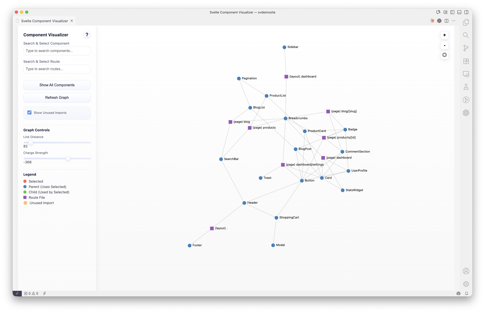
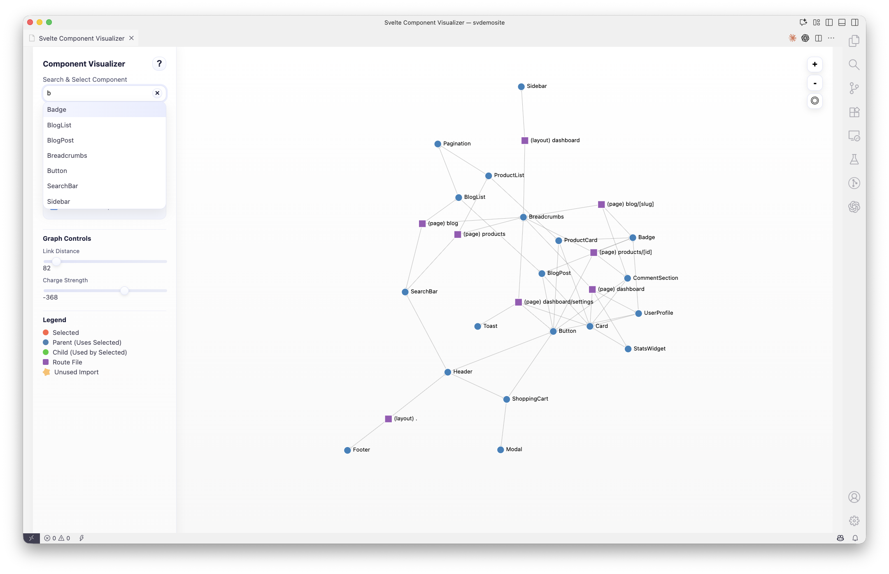
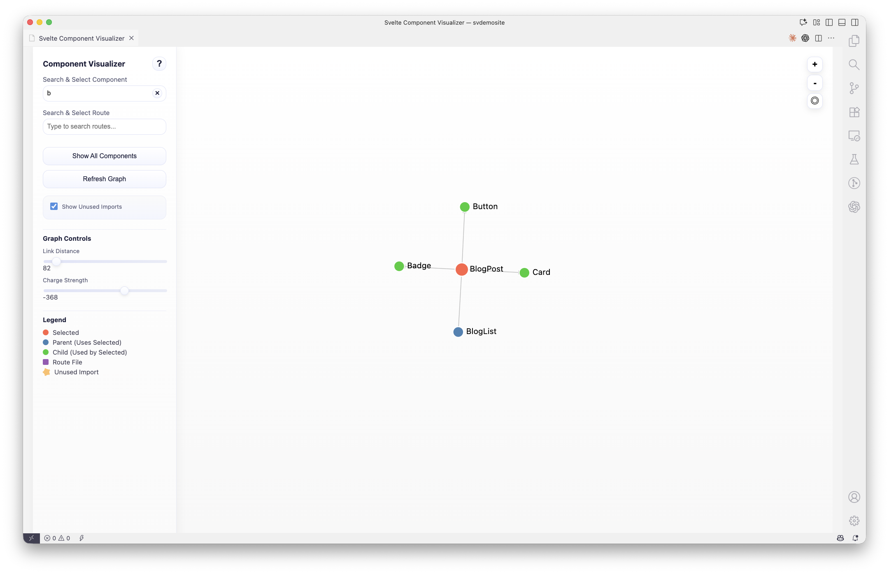
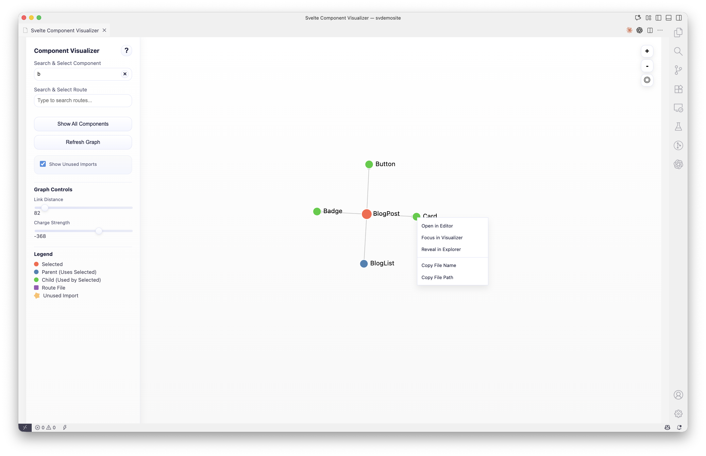

# Svelte Component Visualizer

A VSCode extension that visualizes Svelte component dependencies as an interactive graph, helping you understand and navigate your component architecture.


## Features

- Interactive Dependency Graph - Visualize all component relationships in your Svelte project
- Component and Route Search - Quickly find and focus on specific components or SvelteKit routes
- Multiple Visual Themes - Choose from modern, flat, retro, or retro-alt themes with light/dark modes
- Unused Import Detection - Identify imported but unused components (shown with orange dashed borders)
- Legend Filters - Click legend items to show/hide specific node types (parents, children, routes, unused imports)
- Drag and Drop Support - Drag .svelte files from Explorer onto the graph to focus on them
- Context Menu Integration - Right-click files in Explorer or editor tabs to open in visualizer
- Go to Definition - Double-click any node to open the component file in the editor
- Customizable Layout - Adjust graph physics with link distance and charge strength controls
- Keyboard Shortcuts - Cmd/Ctrl+Click nodes to focus on them
- Route Support - Visualize SvelteKit routes (+page, +layout, +error) alongside components
- Cross-Platform - Works on Windows, macOS, and Linux

## Screenshots

### Interactive Component Graph

*Visualize all component relationships in your Svelte project with an interactive force-directed graph*

### Search and Focus

*Quickly find and focus on specific components or routes*

### Focused View with Dependency Colors

*View a component's direct dependencies with color-coded relationships: red (focused), blue (parents), green (children)*

### Context Menu Integration

*Right-click any .svelte file to open it in the visualizer*

## Usage

### Opening the Visualizer

You can open the visualizer in three ways:

1. Command Palette:
   - Open Command Palette (`Cmd+Shift+P` / `Ctrl+Shift+P`)
   - Type "Svelte: Show Component Visualizer"

2. Explorer Context Menu:
   - Right-click any `.svelte` file in the Explorer sidebar
   - Select "Open in Component Visualizer"

3. Editor Tab Context Menu:
   - Right-click any `.svelte` file tab at the top of the editor
   - Select "Open in Component Visualizer"

### Interacting with the Graph

- Single Click and Drag - Click and drag nodes to reposition them in the graph
- Double-Click - Open the component file in the editor
- Cmd/Ctrl + Click - Focus on a node (shows only its direct dependencies)
- Drag and Drop - Drag a `.svelte` file from Explorer and hold Shift while dropping it onto the graph to focus on it (Desktop VSCode only - see note below)
- Mouse Wheel - Zoom in/out
- Click and Drag Background - Pan around the graph
- Search Boxes - Type to find and focus on specific components or routes
- Show All Button - Reset to display the entire graph
- Refresh Command - Run `Svelte: Refresh Component Graph` from the Command Palette
- Toggle Unused Imports - Show/hide components that are imported but not used in templates
- Legend Filters - Click legend items (Parent, Child, Route, Unused Import) to toggle their visibility in the graph

> **Note for Code OSS / Cloud Workstations**: Drag and drop is not supported in browser-based VSCode environments due to webview limitations. Use the context menu instead: right-click any `.svelte` file and select "Open in Component Visualizer".

### Terminal File References

- Explorer / Editor: Right-click a file and choose **Svelte: Insert File Path in Terminal**
- Visualizer: Right-click a node and choose **Insert File Path in Terminal**
- The path is inserted into the **active integrated terminal session** with a trailing space (no auto-execute)
- Configure `svelteVisualizer.terminalPathPrefix` to control prefix behavior:
  - `"@"` (default): `@src/lib/Button.svelte`
  - `""` (empty): `src/lib/Button.svelte` (useful for tools like Aider)

### Node Colors and Types

- Red Circle - Currently selected/focused component
- Blue Circle - Parent components (components that use the selected one)
- Green Circle - Child components (components used by the selected one)
- Purple Square - Route files (+page.svelte, +layout.svelte, +error.svelte)
- Orange with Dashed Border - Unused imports (imported but not referenced in template)

## Configuration

Configure the extension through VSCode settings (`Cmd+,` / `Ctrl+,`):

```json
{
  "svelteVisualizer.componentPaths": [
    "src/lib/components/**/*.svelte"
  ],
  "svelteVisualizer.routePaths": [
    "src/routes/**/*.svelte"
  ],
  "svelteVisualizer.routesBasePath": "src/routes",
  "svelteVisualizer.theme": "modern",
  "svelteVisualizer.colorScheme": "auto",
  "svelteVisualizer.terminalPathPrefix": "@"
}
```

### Available Settings

#### File Paths

- `svelteVisualizer.componentPaths` (array)
  - Glob patterns for component files to include
  - Default: `["**/*.svelte"]`
  - Example: `["src/lib/**/*.svelte", "!**/routes/**"]`

- `svelteVisualizer.routePaths` (array)
  - Glob patterns for route files to include
  - Default: `["**/routes/**/*.svelte", "**/src/routes/**/*.svelte"]`

- `svelteVisualizer.routesBasePath` (string)
  - Base path for routes (used for route naming)
  - Default: `"routes"`
  - The extension searches for this directory name anywhere in your project

#### Visual Appearance

- `svelteVisualizer.theme` (string)
  - Visual theme for the component visualizer
  - Options:
    - `"modern"` - Rounded corners and gradients (default)
    - `"flat"` - Ableton-like minimal design
    - `"retro"` - Early Mac System 6/7 (light) / Green monochrome (dark)
    - `"retro-alt"` - Windows 3.1 (light) / Amber monochrome (dark)

- `svelteVisualizer.colorScheme` (string)
  - Color scheme for the visualizer
  - Options:
    - `"auto"` - Follows VS Code's theme (default)
    - `"light"` - Always use light mode
    - `"dark"` - Always use dark mode

- `svelteVisualizer.terminalPathPrefix` (string)
  - Prefix used when inserting file references into terminal
  - Default: `"@"`
  - Set to `""` (empty string) to insert plain paths (useful for tools like Aider)

## Requirements

- VSCode: 1.80.0 or higher
- Node.js: 18.x or higher (for development)
- Project: A Svelte or SvelteKit project with `.svelte` files

## Installation

### From Source

1. Clone this repository
2. Run `npm install`
3. Run `npm run compile`
4. Press `F5` to open a new VSCode window with the extension loaded

### From VSIX

1. Run `npm run package` to create a `.vsix` file
2. In VSCode, go to Extensions view
3. Click the `...` menu and select "Install from VSIX..."
4. Select the generated `.vsix` file

## Development

```bash
# Install dependencies
npm install

# Compile TypeScript
npm run compile

# Watch for changes
npm run watch

# Package extension
npm run package
```

## Known Issues

- Graph generation may be slow for very large projects (500+ components)
- Only supports default component imports (not named imports like `import { Component } from './file.svelte'`)
- Dynamic imports via `<svelte:component>` are not tracked
- **Drag and drop not supported in browser-based VSCode** (Code OSS, vscode.dev, GitHub Codespaces, cloud workstations) - This is a limitation of webviews in browser environments. Use the context menu "Open in Component Visualizer" instead.

## Troubleshooting

### Components not showing up?

- Check your `svelteVisualizer.componentPaths` and `svelteVisualizer.routePaths` settings
- Make sure the glob patterns match your project structure
- Run `Svelte: Refresh Component Graph` after changing settings
- Verify files are not in excluded directories (node_modules, .svelte-kit, build, dist)

### Graph looks cluttered?

- Use the search boxes to focus on specific components
- Toggle "Show Unused Imports" off to hide unused components
- Adjust "Link Distance" and "Charge Strength" sliders for better spacing

### Drag and drop not working?

**Browser-based VSCode (Code OSS, cloud workstations, vscode.dev):**
- Drag and drop is NOT supported in browser-based environments due to webview security limitations
- Use the context menu instead: Right-click any `.svelte` file → "Open in Component Visualizer"

**Desktop VSCode:**
- You MUST hold Shift while dropping the file
- The graph border should turn blue when Shift is held
- Without Shift, the file will open in the editor instead of focusing in the visualizer

## Changelog

See [CHANGELOG.md](./CHANGELOG.md) for release history.


## Contributing

Found a bug or have a feature request? Please [open an issue](https://github.com/jamcgrath/svelte-component-visualizer/issues) on GitHub.

## License

MIT
